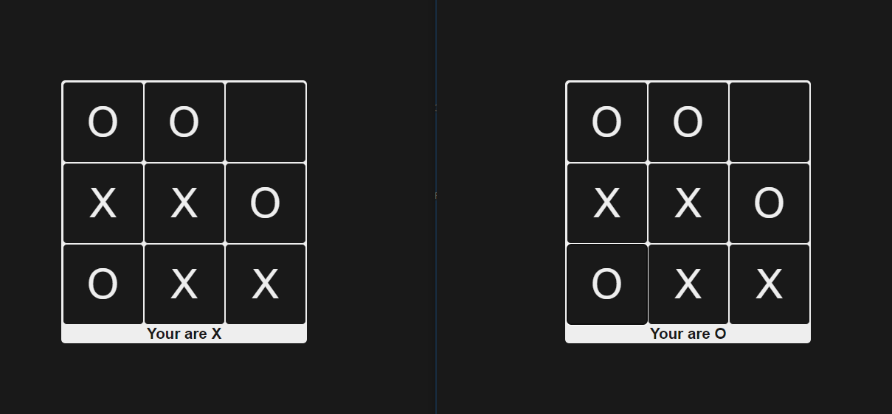
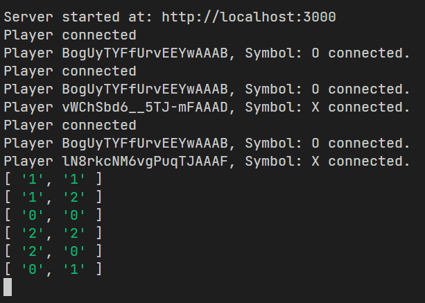

# Express Tic Tac Toe

Real-time Tic Tac Toe over Express.js

<!--## See it working on:
@todo-->

## Requisites

- pnpm, yarn or npm
- clone or download the repo
- install dependencies
- start

## Rules:

- 2 players, one is X, the other is O
- if more people connect, they'll be spectators

## To use:

- After server initiation, access tha game by the URL given on the console
- From the 3rd connection on, the clients will be considered Spectators

### Frontend

### Backend

